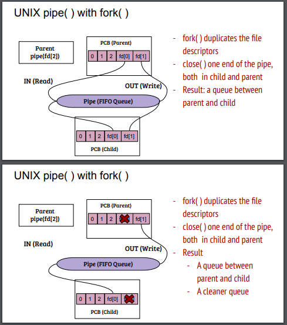
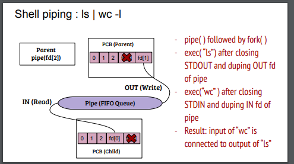

## General Idea
When we run some command in shell, it is the process which is executing. Now piping brings another level of complexity where the output when first process has been executed will be the input for the second process.

## References

1. [GFG pipe system call](https://www.geeksforgeeks.org/pipe-system-call/)
